# PFC — Personal Food Computer

**A grow box that keeps a basil plant alive without anyone tending it, built inside a
scavenged PC tower.** Temperature, humidity and light are measured continuously; lights,
fans and water pumps are switched on a daily cycle; the whole thing is monitored and
overridden from a phone on the local network. The plant is hydroponic, so there is no soil
to water and nothing to remember.

5th-year engineering project (IoT major, ESME Sudria, 2021), carried out for the company
**Hear & Know** on behalf of one of their customers. It is the direct sequel to our
4th-year [Aquarium Monitoring System](https://github.com/Nicolas-Rigaudy/Aquarium-Monitoring-System) —
same Raspberry Pi, several of the same sensors, a much more demanding closed loop.

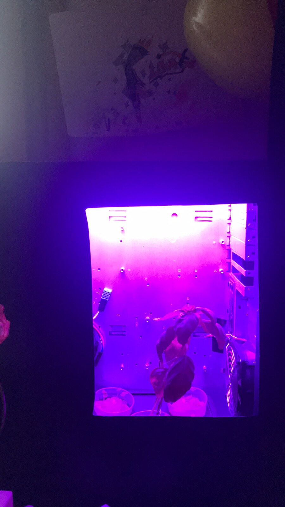

*The finished PFC in a dark room. The only thing visible from outside is the window we sawed
into the front door and the grow lights behind it.*

---

## Context

A Personal Food Computer is an enclosed box that grows plants under environmental conditions
you control instead of ones you inherit — temperature, humidity and photoperiod all set
deliberately, indoors, year-round. Hear & Know offered us the brief; the constraint we added
ourselves was **upcycling**, because a green project that ships new hardware for every part is
not much of a green project.

So the enclosure is an old PC tower. The pots are yogurt containers. Both fans came out of the
same dead computer — one is the original case fan, the other came off its power supply. What we
bought was the sensors, the relay board, the pumps and the substrate.

The plant is **basil**, grown **hydroponically**: roots sit directly in a nutrient water tank
instead of soil. That choice removes the hardest thing to automate — irrigation — and replaces
it with a tank that needs topping up about once a month.

We scoped the project in three explicit levels before building anything, which is what kept it
finishable:

| Level | Definition | Outcome |
|---|---|---|
| **1 — Minimum** | A box that grows plants, with sensors monitoring it | Reached |
| **2 — Project goal** | All identified functions, plus an interface to check and regulate, in a presentable enclosure | Reached — this is what the repo contains |
| **3 — Perspective** | The Pi doing more than driving relays: image analysis of plant health, solar power, MQTT, extra modules | Designed, not built — see [Perspective](#perspective-designed-not-built) |

The functional analysis behind it (`FP1`/`FP2` principal functions, `FC1`–`FC6` constraints) is
in [the report](report/PFC_Final_Report.pdf); the short version is that two functions actively
fought each other, and that fight shaped the build. **FP1** wants the user to *see* the plant,
which means a window. **FC1** wants the box to *control* the light, which a window undermines by
letting daylight in.

## How it works

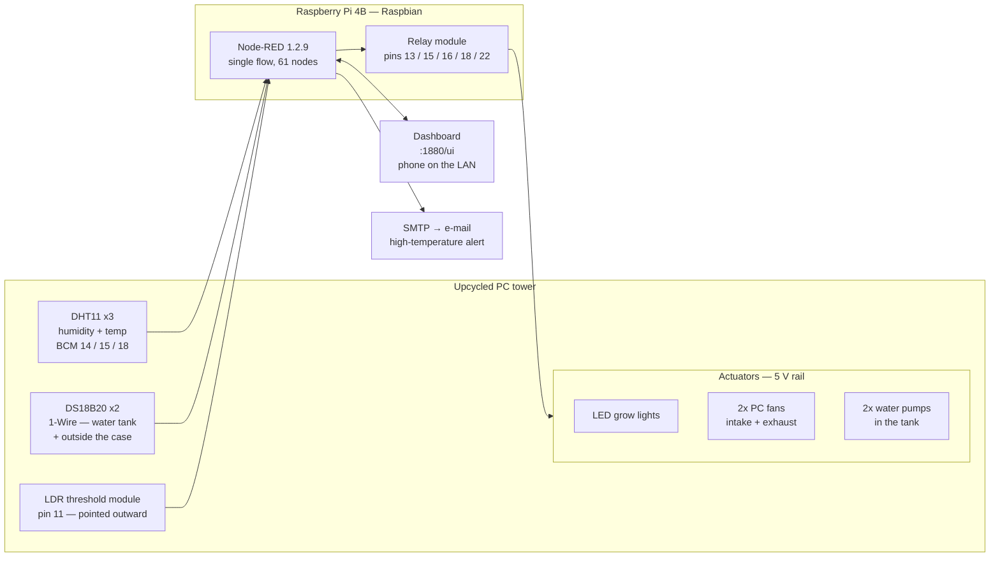

There is no cloud and no database. Every decision is taken on the Pi, and the dashboard is
served by the Pi itself — which is deliberate: the box has to keep running its cycle whether or
not anyone is watching it, and whether or not the internet is up.

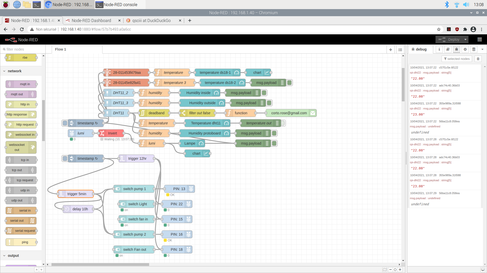

*The whole system, in one flow. Sensors on the left feed gauges and charts; the cycle logic and
the five relay switches are at the bottom; the DHT11 branch through `deadband → filter out
false` is the temperature alert.*

## Hardware

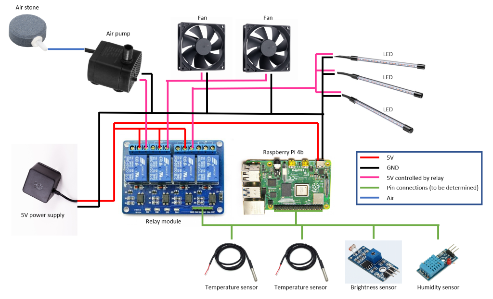

*Power delivery and control. Red is 5 V, black ground, pink the 5 V lines the relay switches,
green the Pi's pin connections to the sensors.*

The important structural decision is the **two separate power circuits**. The Pi runs on its
own supply and never sources current for a load; a second 5 V supply feeds the actuators, and
the Pi only decides — through the relay module — which of them is connected. That is what keeps
five loads from browning out or overheating the computer driving them.

| | Part | Where | Notes |
|---|---|---|---|
| **Sensors** | 3× **DHT11** | inside: near plants, near fans, near the electronics | Humidity *and* temperature. BCM 14 / 15 / 18 |
| | 2× **DS18B20** | in the water tank, and outside the case | Waterproof, 1-Wire, reused from the aquarium project |
| | 1× **LDR module** | pointing *out* of the case | Threshold comparator, not a lux meter — see below |
| **Actuators** | **LED grow lights** | above the plants | Control box removed so a relay can switch them |
| | 2× **PC fans** | top-left exhaust, bottom-right intake | 12 V fans deliberately run at 5 V |
| | 2× **water pumps** | submerged in the tank | Bought by mistake instead of an air pump, and kept |
| **Control** | **Relay module** | HDD tray | Programmable switch array on the 5 V load circuit |

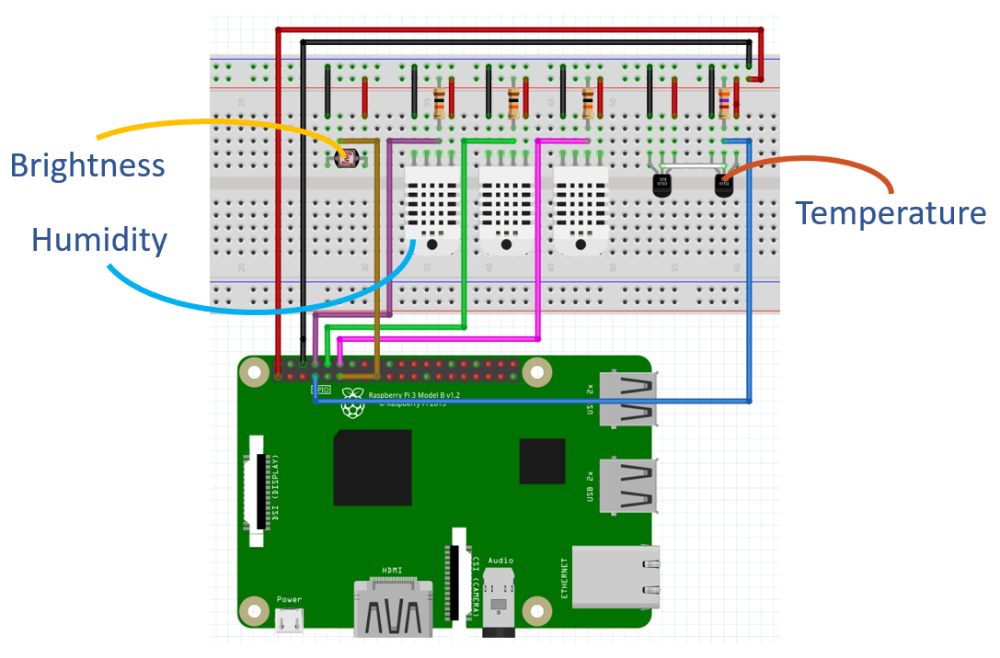
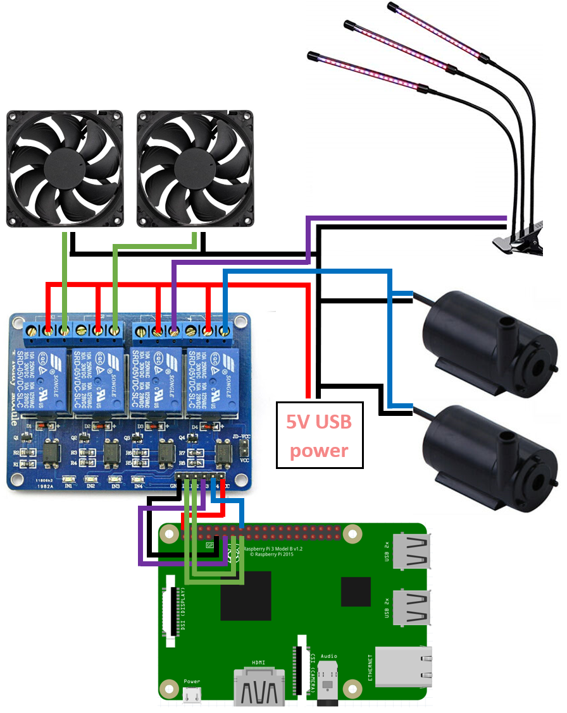

### Where everything sits

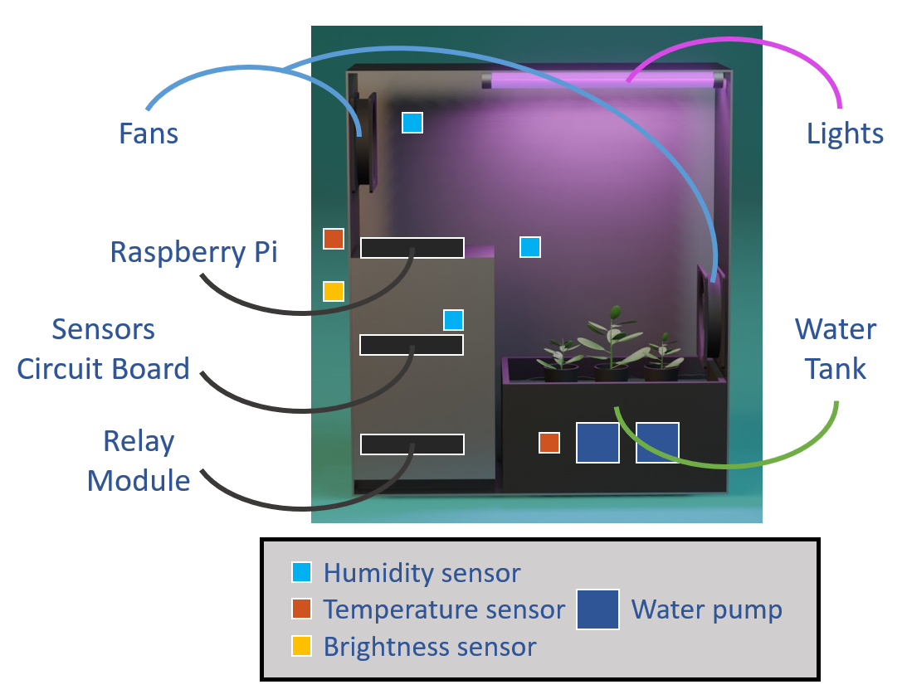

The case's original hard-drive trays turned out to be the right shelves for the Pi, the sensor
board and the relay board — which hides the cabling and leaves the plant side clean. Airflow is
diagonal: exhaust at the top left pulls out air warmed by the lights, intake at the bottom
right brings cooler air in near the plants. In a colder room you would reverse them, which is
why they are independently switchable rather than wired together.

### Breadboard → protoboard

| Prototype | Final |
|---|---|
| 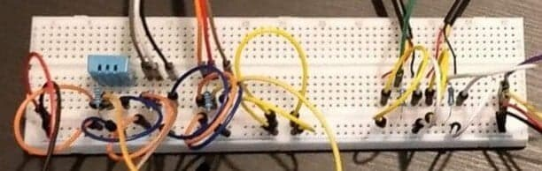 | 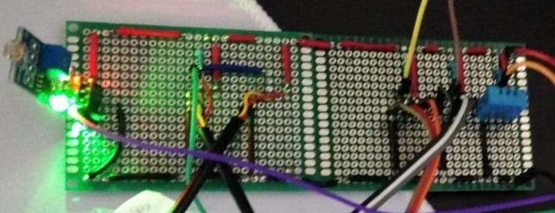 |

Breadboards were right for finding the circuit and wrong for keeping it: jumper wires work
loose, and the PFC had to survive being carried between apartments. Everything was soldered
onto protoboards for the final build. This migration was requested by the client *after* we had
bought a full set of breadboards — see [Working with a client](#working-with-a-client).

### The window

| 3D design (Blender) | The panel, cut and glazed |
|---|---|
| 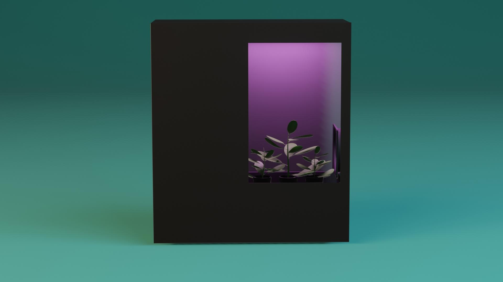 | 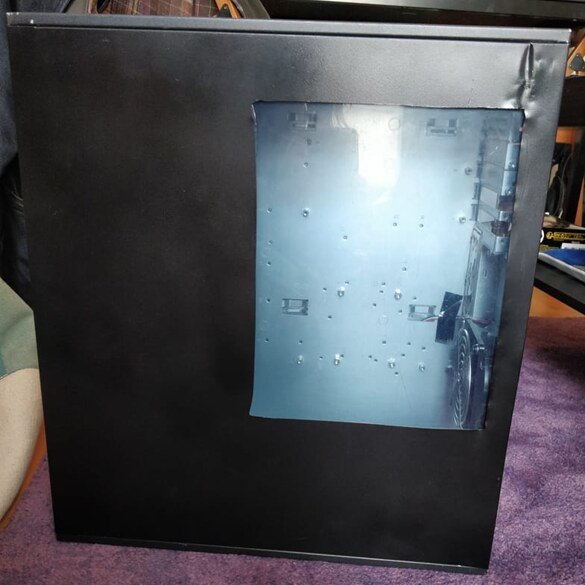 |

The PC case had an opaque metal front door. We sawed an opening into it and glued a plexiglass
sheet behind the cut, because a grow box you cannot look into gives the user no way to judge
plant health without opening it and disturbing the environment.

## Software

Node-RED, one flow, 61 nodes — no application code. Every sensor read, every gauge, the daily
cycle and the alert are nodes and wires. That was a deliberate trade: for a system whose logic
is *"switch these five things according to time and temperature"*, a flow that a non-programmer
can read and retune beats a Python service nobody else can touch.

Getting there took two rejections. An **Android app with a cloud database** was our first
instinct — we had built exactly that the year before for the aquarium — and the client pushed
back in favour of an off-the-shelf home-automation layer. **Domoticz** came next and failed
concretely: it detected the Raspberry Pi but not the individual sensors attached to it. Node-RED
worked because its node library is community-built, so the specific sensors we had already
existed as nodes (see [`node-red/package.json`](node-red/package.json) for the exact set).

### Dashboard

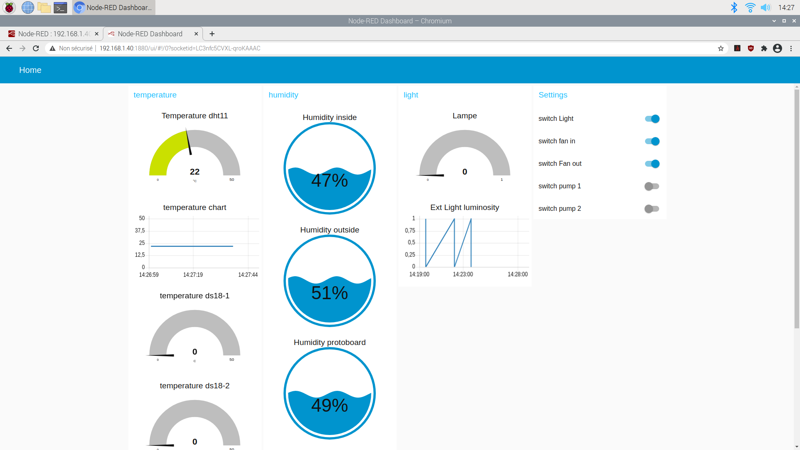

Four columns: **temperature**, **humidity**, **light**, **Settings**. Gauges for current values,
line charts for recent history, and five switches that override any actuator directly — for a
noisy pump or a failed fan, without the user touching the flow or the wiring.

The two DS18B20 gauges read `0` in this screenshot. That is the sensor-ID misconfiguration
described in the report, captured before it was fixed; the saved flow in this repo still carries
it (see [Status](#status--this-is-an-archive)).

### The cycle

A cron inject at **09:00** fires two chains:

- **Light and air** — a 12-hour trigger holds the grow lights and both fans on, then releases
  them. Basil starts on a 12-hour photoperiod during growth and moves toward 16 hours.
- **Water** — the pumps run **5 minutes every 10 hours**, via a 5-minute trigger and a 10-hour
  delay loop.

The pump timing is the one number we got wrong first and corrected by observation. The initial
cycle ran the pumps for the full 12 hours alongside the lights. The water only needs a few
minutes a day to stay oxygenated; twelve hours of it damages the roots and makes a noise nobody
wants in their kitchen.

A **Start new Cycle** button on the dashboard re-fires both chains, so harvesting and replanting
does not mean waiting until the next morning or editing the flow.

### The alert

The DHT11 branch feeds a `deadband` node into a filter and a function that builds a fixed
`"emergency high temperature"` message, sent out through an SMTP node. This is the one path that
reaches outside the local network, and the only one that asks for the user's attention rather
than waiting to be checked.

## Repository layout

| Path | What's in it |
|---|---|
| [`node-red/flows_raspberrypi.json`](node-red/flows_raspberrypi.json) | **The system.** The complete flow: sensors, dashboard, cycle, relays, alert. |
| [`node-red/package.json`](node-red/package.json) | The Node-RED contrib nodes the flow depends on — the DHT, DS18B20, GPIO, dashboard and e-mail nodes. |
| [`prototypes/`](prototypes/) | The standalone Python scripts written to prove each device worked before it went into the flow. |
| [`report/PFC_Final_Report.pdf`](report/PFC_Final_Report.pdf) | The 41-page final report: functional analysis, plant study, user guide, challenges, perspective. |
| [`docs/`](docs/) | Report figures and Pi screenshots used above. |

### Prototypes

Original filenames kept, because their sequence is the record of what was actually hard.

| Script | Device | What it establishes |
|---|---|---|
| [`dht11_simple.py`](prototypes/dht11_simple.py) | DHT11 | `Python_DHT` — first library tried |
| [`Testhumidity2.py`](prototypes/Testhumidity2.py) | DHT11 | `Adafruit_DHT` — second, and where the offset hack lived |
| [`testHumidity.py`](prototypes/testHumidity.py) | DHT11 | `adafruit_dht` + `board` (CircuitPython) — third |
| [`testmodulerelay.py`](prototypes/testmodulerelay.py) | Relay module | Switches a channel on and off on a timer, and confirms the board is **active-low**: `GPIO.LOW` closes the relay |

Three libraries for one sensor is not indecision; it is the [DHT11 story](#the-dht11-that-lied).
The DS18B20 and LDR scripts are not here — they were written the year before for the aquarium and
live in [that repository](https://github.com/Nicolas-Rigaudy/Aquarium-Monitoring-System)
(`Archive/Sensors/`).

## Running it

Requires real hardware — the flow talks to GPIO pins and 1-Wire devices, so it does not do
anything useful on a machine that lacks them.

```sh
# On a Raspberry Pi with Node-RED installed
sudo modprobe w1-gpio w1-therm          # 1-Wire, for the DS18B20 probes
cd ~/.node-red && npm install           # after copying node-red/package.json
cp <repo>/node-red/flows_raspberrypi.json ~/.node-red/
node-red-start                          # editor on :1880, dashboard on :1880/ui
```

The DS18B20 nodes need the real sensor IDs (`ls /sys/bus/w1/devices/`) pasted into their config —
the ones saved in the flow are placeholders.

## Project challenges

The engineering content of this project is mostly here: the parts that did not behave, and what
we did about it.

### The DHT11 that lied

| The reading | The workaround |
|---|---|
| 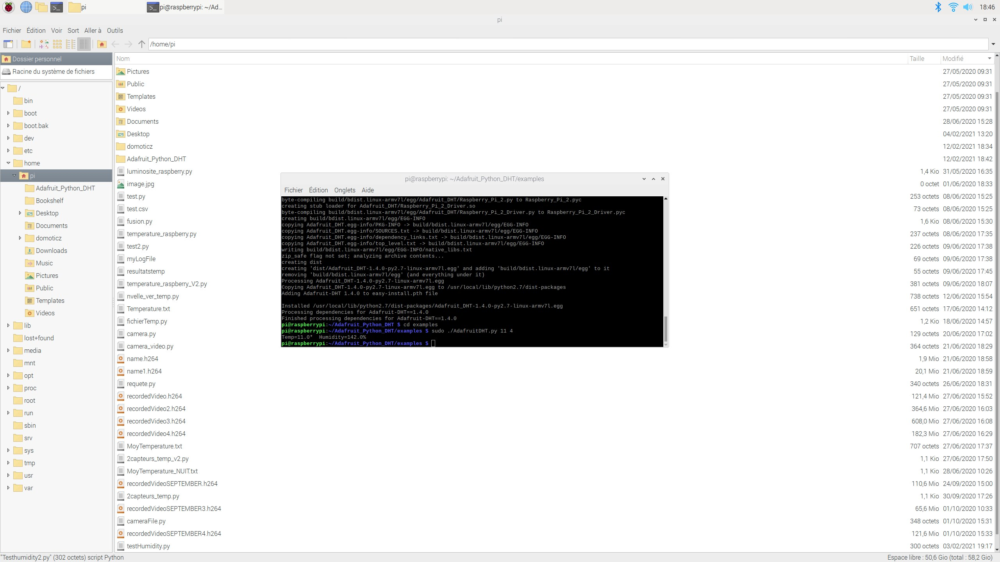 | 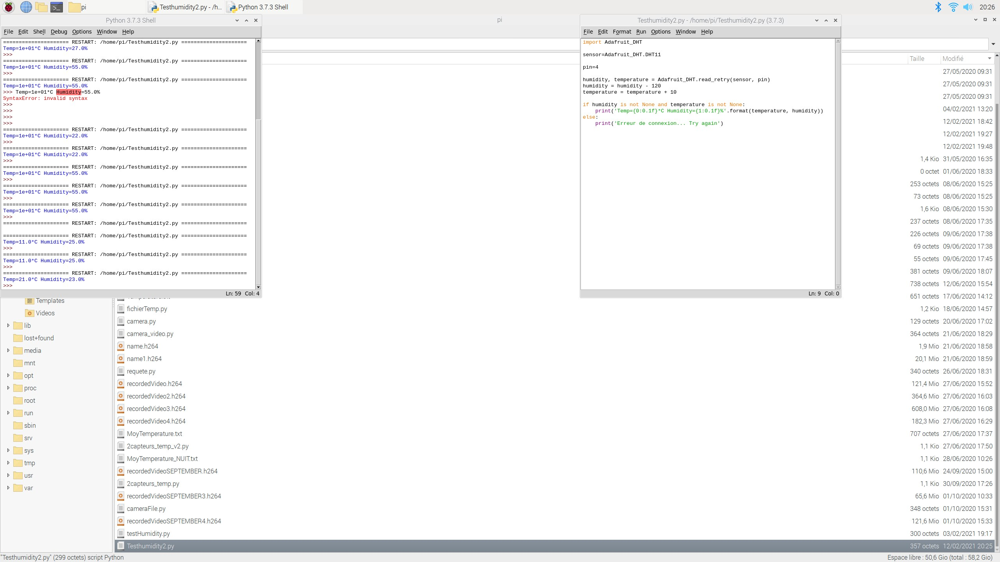 |

`Adafruit_DHT` returned **142 % humidity at 11 °C** in a normal room. Both numbers are
impossible, and impossible by a suspiciously constant amount — so the first patch was literally
`humidity = humidity - 120` and `temperature = temperature + 10`, visible in the second
screenshot.

That is a bad fix and we knew it: a constant offset assumes the error is constant, and nothing
justified that assumption. It bought us a working sensor for the afternoon. The real fix was
switching to the Node-RED `dht-sensor` node, which read correctly, and is why the flow does not
use any of the three Python libraries. `Testhumidity2.py` in this repo is the cleaned-up version —
the offsets are gone, but the vestigial `humidity = humidity` line marks where they were.

### Fans that were too good

Both fans are 12 V parts salvaged from a PC, sized to cool a CPU rather than ventilate a plant.
We ran them from the 5 V actuator rail instead. Underdriving them solved three problems at once:
they no longer blast enough air to damage basil leaves, they are much quieter, and the whole
actuator side stays on a single 5 V circuit with no separate 12 V rail to build.

Airflow is aimed at the **leaves, not the roots** — ventilating the roots fights the hydroponics
by accelerating evaporation from the tank.

### Grow lights that could not be switched

The lights Hear & Know supplied came with a control box for on/off, brightness and colour.
Convenient for prototyping, and unusable for automation: wiring them through the relay did
nothing, because the control box still expected a human to press its power button.

Our first idea was a potentiometer — dim the lights to near-zero instead of switching them off,
leaving the client's hardware intact. We rejected it on two counts: we could not establish what
even a little light during the dark phase does to the plant, and it keeps the lamps powered
24 hours a day for no reason. The control box came off, and the relay drives the lights directly.

### A brightness sensor that measures the wrong thing

We reused the LDR module from the aquarium project, on the reasonable assumption that a box
which regulates light needs a light sensor. It does — but not this one. The module is a
comparator with a sensitivity trimmer: it reports `1` above a threshold and `0` below, and
nothing in between. Inside the enclosure it can only answer *"are the grow lights on?"* — a
question the user answers faster by glancing at the window.

So we turned it around and pointed it **out** of the case, where a binary reading is genuinely
informative: *is it daytime, or has the user switched the room light off?* That reframes the
sensor from a failed regulator into a useful input for the photoperiod — and it is a better
outcome than the part deserved.

### A window versus a light cycle

The plexiglass window that satisfies FP1 lets daylight into an enclosure whose entire value
proposition is a light cycle *better* than the sun's. It also exposes the grow lights to
sunlight, which is not recommended. The proposed fix — tinted plexiglass, dimmer inside, still
transparent enough to inspect the plant — was never fitted.

### Sensors we did not need

We bought 5 DHT11s because that was the smallest quantity available, which turned out to be
lucky: one burned out during a test on a bad connection. But since the DHT11 also reports
temperature and we already had two DS18B20 probes, the parts list added up to **seven
temperature sensors** for a box that needs about two.

We used three DHT11s, placed at genuinely different spots — near the plants, near the fans, near
the electronics — and the two DS18B20s where waterproofing actually matters: one in the tank, one
outside the enclosure. Honestly assessed, one DHT11 plus the two probes would have done it.

### A water pump where an air pump should be

We ordered the wrong part and only discovered it on delivery. Blowing air through a submerged
tube did nothing; submerging the pump moved water. Rather than reorder, we tested whether
circulating water oxygenates the tank well enough — it does — and kept the mistake.

### Working with a client

The lesson was about specification, not technology. We told Hear & Know the sensors would go on
breadboards; they agreed; after we had wired and bought a full set, they asked for protoboards.
The request was right — soldered joints survive transport, jumper wires do not — but it arrived
after the money was spent, because *"breadboard"* had been mentioned in a meeting instead of
written into an agreed scope.

What we changed: write down what was decided, and write a report per meeting. Our school tutor,
Mr Adrien Duprez, was most useful precisely here — pinning goals down explicitly so that
additions could be recognised as additions.

## Results

### The plant

Basil, grown two ways in parallel — an adult plant and seeds — over three weeks, in Rockwool
cubes and cotton pads.

| Week | Adult plant | Seeds |
|---|---|---|
| 1 | Hydroponics running, lights not yet working. Leaves lost strength and flattened — too much water, no light | Germinating |
| 2 | 12-hour photoperiod switched on. Leaves visibly stronger and more curved | **+3 cm** in a week |
| 3 | One weak stem began to rot and was removed to protect the rest; the remaining stem kept strengthening | One cup thriving, one struggling to keep its leaves |

Curvature is the readable signal on basil: healthy leaves curve, stressed leaves flatten. Week 1
versus week 2 is the clearest evidence in the project that the light cycle does what it is
supposed to.

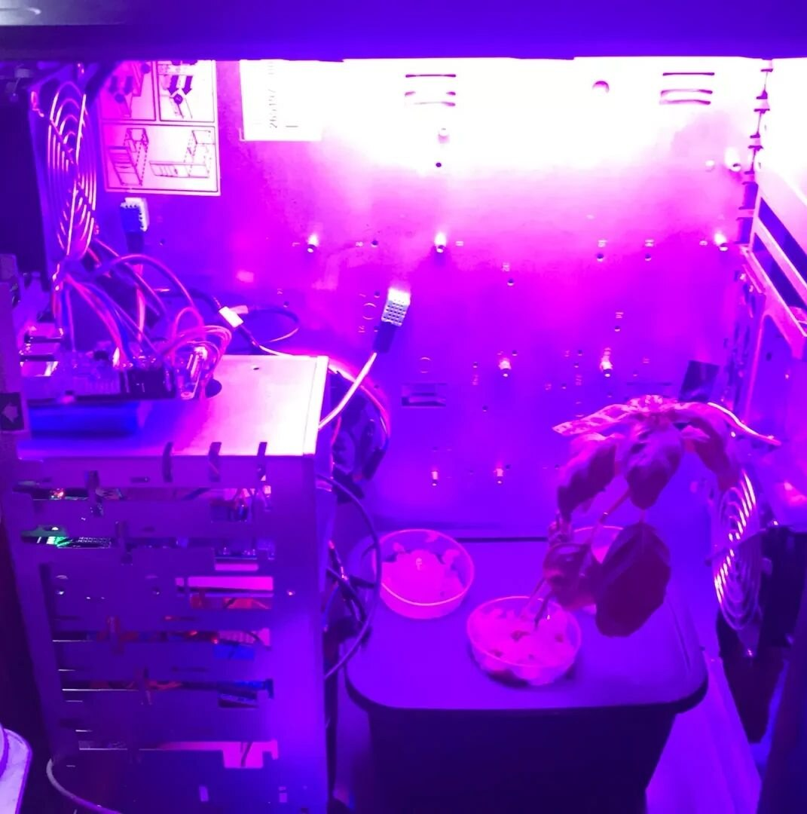

*Inside the box under the grow lights. Left: the fan, the Pi and the protoboards on the old HDD
trays. Centre: a DHT11 on the back panel. Right: the plants in their cups on the tank lid.*

### The users

We put the PFC in a kitchen for a week with **5 people** using it and our user guide, and took
notes on what they asked. Nobody struggled with installation — the hydroponics setup carried
most of it. What they asked about was **water near electricity**, the lamps, and the wifi
connection.

Every one of those is a safety or setup concern rather than a usability one, which is why the
[report's](report/PFC_Final_Report.pdf) user guide ends in a Warnings section written directly
from their questions: do not block the fans, unplug both plugs before harvesting, close the tank
lid before powering on, do not stare into the grow light.

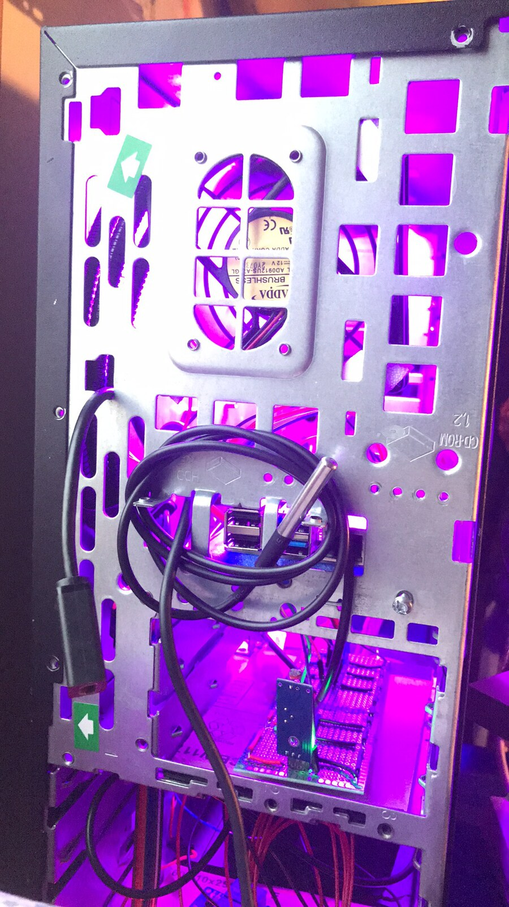

*The left flank: the exhaust fan, the DS18B20 probe on its long lead (it reaches about a metre
from the case, to read room temperature), the LDR module on the protoboard below, and the Pi's
own ports.*

## Status — this is an archive

The PFC ran, grew basil, and was tested by real users in 2021. This repository is what survived
on the Pi's SD card, and it is not a deployable product:

- **The DS18B20 nodes are misconfigured.** Both carry `sensorid: "not found."` and both are
  labelled with the *same* ID (`28-01145e82fa41`), though the hardware had two distinct probes.
  They need real IDs from `/sys/bus/w1/devices/` to read anything.
- **Pin numbering is mixed.** The relay and LDR nodes use *physical* board pins (11, 13, 15, 16,
  18, 22); the DHT11 nodes use *BCM* GPIO numbers (14, 15, 18). Both conventions appear as bare
  numbers in the flow, so `15` means two different pins depending on the node. Read them against
  the wiring diagrams above, not against each other.
- **Charts keep 10 minutes**, not the 20 hours the report describes — the flow was retuned after
  the text was written. The Grafana long-term history that was supposed to replace them was never
  built.
- **The e-mail credential is not in this repo.** Node-RED stored the SMTP password in
  `flows_raspberrypi_cred.json`, which is deliberately excluded. The `e-mail` node will need its
  own credentials re-entered.
- **No MQTT, and no wifi onboarding.** The report describes opening a port so a user could enter
  their wifi password without attaching a keyboard to the Pi. There is nothing implementing that
  in the flow, and MQTT — the intended path to control the box from outside the LAN — was
  explicitly left for later.
- **No authentication.** The dashboard and the Node-RED editor are both open to anyone on the
  local network. Acceptable in a flat, not on an untrusted network.
- **Access was LAN-only.** The system was reached by typing the Pi's local IP. Every screenshot
  here shows a different one (`192.168.1.23`, `192.168.1.40`) because the address moved with the
  network, which is exactly the problem MQTT was meant to solve.

## Perspective — designed, not built

Level 3 in the project scoping. None of this exists in the repository; it is recorded because it
is where the project was heading and because the report argues for it in detail.

**Closing the loop on the sensors we already have.** The outside LDR and the outside DS18B20 are
currently displayed but not acted on. They should drive decisions: cut the grow lights when
daylight is sufficient; stop the exhaust fan when it is cold outside so warm air is not thrown
away; stop both fans when the room is already at the right temperature, to save power and noise.
Every input for this is wired and reading — only the logic is missing.

**Watching the plant instead of the air.** The most interesting proposal is optical: use the Pi
camera to judge plant health directly. Leaf **colour** (apple green healthy, dark green not) and
leaf **curvature**, read through light reflection, are both visible to a camera, and both were
signals we were already reading by eye every week. A third idea sizes the plant against virtual
circles drawn around each cup, to notify the user when it is ready to harvest. We had done
OpenCV work on the aquarium project, so this was a known quantity — and still a whole computer
vision project sitting inside an IoT one.

**Using the computer we over-specified.** A Pi 4B spends most of its day idle driving five
relays; a Pi Zero would have done the job. Given that the hardware is there, the report proposes
earning it back — NAS, wifi router, browser interface — and pairing it with a solar panel, on the
argument that the Pi's demand and a panel's output peak at the same time of day.

**Industrially**, the same closed loop scales in an obvious direction: smart greenhouses,
multi-storey and rooftop city farms, underground farms where grow lights beat inconsistent
daylight, and eventually plant growth somewhere without a usable outside environment at all.
Across a field rather than a box, the sensor units would want LPWAN — LoRaWAN — rather than wifi:
very little data, very little power, a lot of range.

## Credits

**Julien Rosé · Achille Bayart · Nicolas Rigaudy** — 5th year, IoT major, ESME Sudria.

Client: **Hear & Know** — Jean-Philippe Lelievre, Hubert Thiriar, Mohammad Reza Zohrabi.
School tutor: **Adrien Duprez**.

Managed on Slack and Trello (with TeamGantt for scheduling), built at Nicolas' flat, and
reported on over Zoom, Meet and Teams — the project ran through the Covid period, which is why
the meeting list is longer than the parts list.

Previous project: [Aquarium Monitoring System](https://github.com/Nicolas-Rigaudy/Aquarium-Monitoring-System)
(4th year) — the Raspberry Pi, the DS18B20 probes and the LDR module in this build all came from it.
